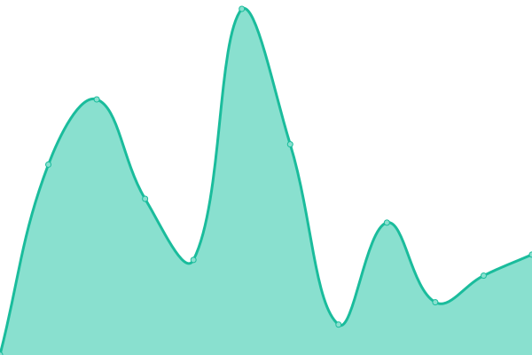
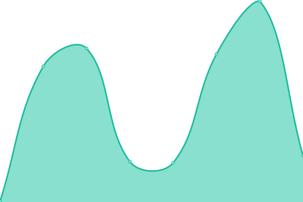

# [📈 Live Status](https://demo.upptime.js.org): <!--live status--> **🟧 Partial outage**

This repository contains the open-source uptime monitor and status page for [kainny56](https://demo.upptime.js.org), powered by [Upptime](https://github.com/upptime/upptime).

With [Upptime](https://upptime.js.org), you can get your own unlimited and free uptime monitor and status page, powered entirely by a GitHub repository. We use [Issues](https://github.com/kainny56/uptime/issues) as incident reports, [Actions](https://github.com/kainny56/uptime/actions) as uptime monitors, and [Pages](https://demo.upptime.js.org) for the status page.

<!--start: status pages-->
<!-- This summary is generated by Upptime (https://github.com/upptime/upptime) -->
<!-- Do not edit this manually, your changes will be overwritten -->
<!-- prettier-ignore -->
| URL | Status | History | Response Time | Uptime |
| --- | ------ | ------- | ------------- | ------ |
|  [끄투블루](https://kkutu.blue) | 🟥 Down | [.yml](https://github.com/kainny56/uptime/commits/HEAD/history/.yml) | 

 833ms
     
 | 

<a href="https://kainny56.github.io/uptime/history/">100.00%</a>
    

|  [마크블루](https://mc.kkutu.blue) | 🟥 Down | [.yml](https://github.com/kainny56/uptime/commits/HEAD/history/.yml) | 

 833ms
     
 | 

<a href="https://kainny56.github.io/uptime/history/">100.00%</a>
    

|  [CDN](https://cdn.jsdelivr.net) | 🟩 Up | [cdn.yml](https://github.com/kainny56/uptime/commits/HEAD/history/cdn.yml) | 

 632ms
     
 | 

<a href="https://kainny56.github.io/uptime/history/cdn">100.00%</a>
    

|  [CDN2](https://ko.imgbb.com) | 🟩 Up | [cdn-2.yml](https://github.com/kainny56/uptime/commits/HEAD/history/cdn-2.yml) | 

 182ms
     
 | 

<a href="https://kainny56.github.io/uptime/history/cdn-2">100.00%</a>
    

<!--end: status pages-->

[**Visit our status website →**](https://demo.upptime.js.org)

## 📄 License

- Powered by: [Upptime](https://github.com/upptime/upptime)
- Code: [MIT](./LICENSE) © [kainny56](https://demo.upptime.js.org)
- Data in the `./history` directory: [Open Database License](https://opendatacommons.org/licenses/odbl/1-0/)
